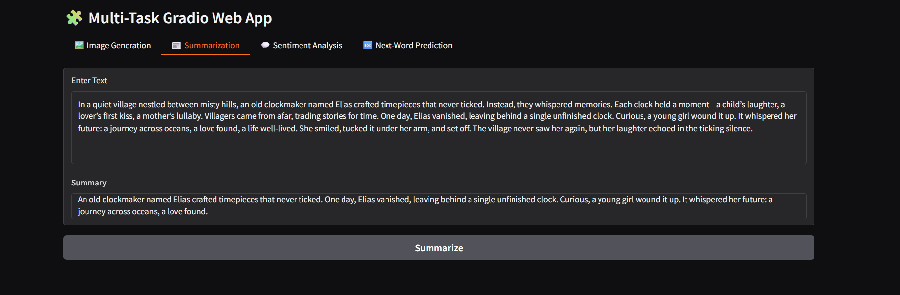
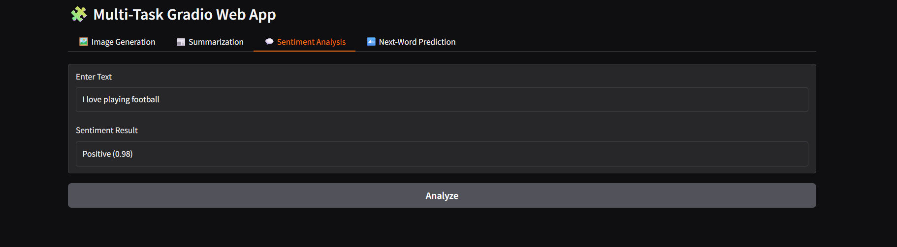
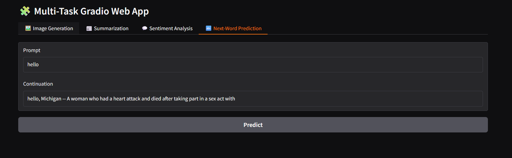
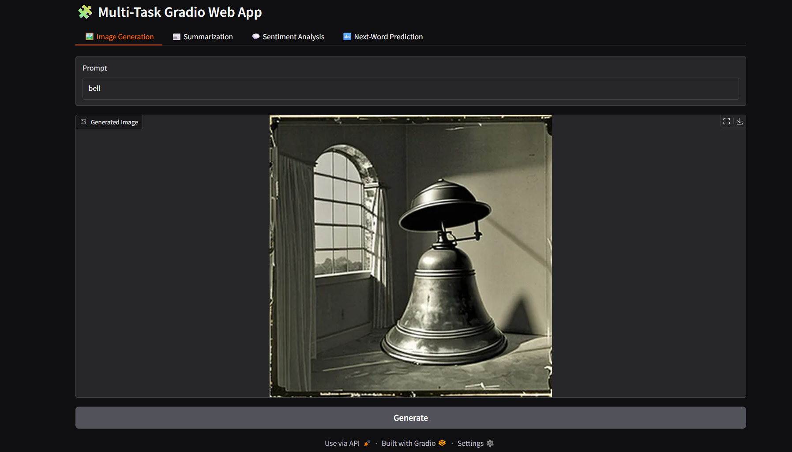
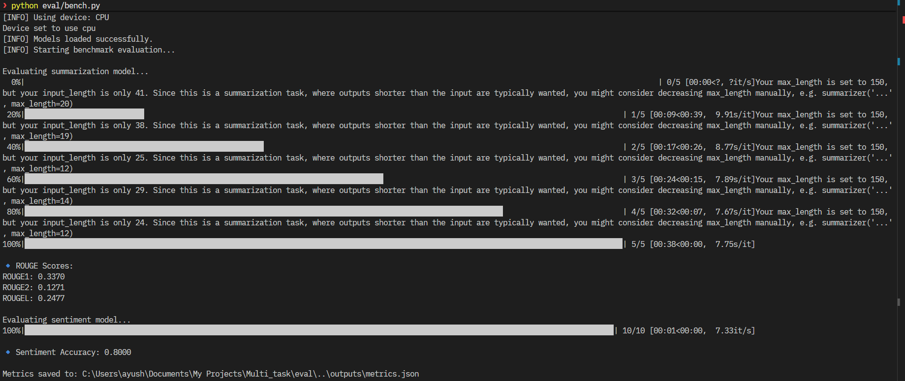

## 🧩 **Multi-Task AI Web App**

An interactive **Gradio-based AI application** that performs multiple Natural Language Processing and Computer Vision tasks — including **Summarization**, **Sentiment Analysis**, **Next-Word Prediction**, and **Image Generation** — all in a single web interface powered by Hugging Face Transformers and Diffusers.

---

### 🎥 **Demo**


| Task                    | Screenshot                                          |
| ----------------------- | --------------------------------------------------- |
| 📰 Summarization        |  |
| 💬 Sentiment Analysis   |          |
| 🔤 Next-Word Prediction |           |
| 🖼 Image Generation     |    |
| 📊 Evaluation Results   |           |

*(You can capture screenshots from your running app in browser and save them inside `assets/` folder.)*

---

### 🚀 **Features**

| Task                        | Model                                       | Description                                                   |
| --------------------------- | ------------------------------------------- | ------------------------------------------------------------- |
| 📰 **Summarization**        | `facebook/bart-large-cnn`                   | Summarizes long text into concise bullet points or paragraphs |
| 💬 **Sentiment Analysis**   | `cardiffnlp/twitter-roberta-base-sentiment` | Detects emotional polarity: Positive, Neutral, or Negative    |
| 🔤 **Next-Word Prediction** | `gpt2`                                      | Predicts text continuation and contextually fitting phrases   |
| 🖼 **Image Generation**     | `CompVis/stable-diffusion-v1-4`             | Generates AI art and images from natural text prompts         |

---

### 🌲 **Project Structure**

```
Multi_task_AI_Web_App/
│
├── app.py                   # Main Gradio application
├── requirements.txt          # Dependencies
│
├── configs/
│   └── app.yaml              # Configuration for app settings
│
├── models/
│   └── registry.py           # Model loading registry
│
├── assets/
│   ├── prompts.csv           # Example prompts for image generation
│   ├── sentiment.csv         # Example sentiment test cases
│   ├── summaries.csv         # Example summarization articles
│   ├── demo_summarization.png
│   ├── demo_sentiment.png
│   ├── demo_nextword.png
│   ├── demo_imagegen.png
│   └── demo_metrics.png
│
├── eval/
│   ├── metrics.py            # ROUGE and accuracy computation
│   └── bench.py              # Runs evaluation benchmarks
│
└── outputs/
    ├── images/               # Generated images
    ├── summaries/            # Summarized text outputs
    ├── logs/                 # Sentiment / prediction logs
    └── metrics.json          # Evaluation metrics
```

---

### ⚙️ **Installation**

#### 1️⃣ Clone the repository

```bash
git clone https://github.com/evirac/Multi_task.git
cd Multi_task_AI_Web_App
```

#### 2️⃣ Create a virtual environment

```bash
python -m venv venv
source venv/bin/activate       # (macOS/Linux)
venv\Scripts\activate          # (Windows)
```

#### 3️⃣ Install dependencies

```bash
pip install -r requirements.txt
```

---

### ▶️ **Run the App**

Start the Gradio interface locally:

```bash
python app.py
```

Then open your browser at the displayed URL (usually `http://127.0.0.1:7860`).

Each task tab operates independently and all results are saved automatically in `/outputs/`.

---

### 📊 **Evaluate Models**

Run the built-in benchmark script to measure summarization and sentiment performance:

```bash
python eval/bench.py
```

output:

```
ROUGE1: 0.3370
ROUGE2: 0.1271
ROUGEL: 0.2477
Sentiment Accuracy: 0.8000
✅ Metrics saved to: outputs/metrics.json
```

---

### 🧠 **Configuration**

Modify tab visibility, saving options, and appearance in:

```yaml
# configs/app.yaml
app:
  title: "Multi-Task AI Web App"
  theme: "default"
  enable_tabs:
    summarization: true
    sentiment_analysis: true
    next_word_prediction: true
    image_generation: true

advanced:
  save_outputs: true
```

---

### 📂 **Output Files**

| Type                     | Path                   | Format  |
| ------------------------ | ---------------------- | ------- |
| Generated Images         | `outputs/images/`      | `.png`  |
| Summaries                | `outputs/summaries/`   | `.txt`  |
| Sentiments & Predictions | `outputs/logs/`        | `.json` |
| Evaluation Metrics       | `outputs/metrics.json` | `.json` |

---

### 🧰 **Tech Stack**

* **Python 3.10+**
* **PyTorch**
* **Hugging Face Transformers**
* **Diffusers**
* **Gradio**
* **ROUGE & Scikit-learn**
* **YAML Configuration**

---

### 🧑‍💻 **Author**

Developed by **Ayush Gupta**
